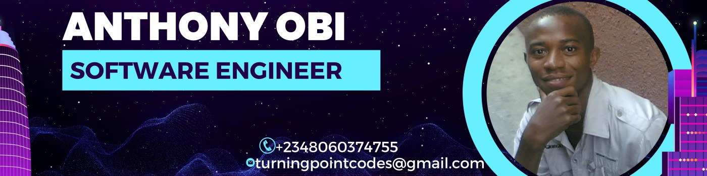

<a name="readme-top"></a>

<!--
!!! IMPORTANT !!!
This README is an example of how you could professionally present your codebase.
Writing documentation is a crucial part of your work as a professional software developer and cannot be ignored.

You should modify this file to match your project and remove sections that don't apply.

REQUIRED SECTIONS:
- Table of Contents
- About the Project
  - Built With
  - Live Demo
- Getting Started
- Authors
- Future Features
- Contributing
- Show your support
- Acknowledgements
- License

OPTIONAL SECTIONS:
- FAQ

After you're finished please remove all the comments and instructions!

For more information on the importance of a professional README for your repositories: https://github.com/microverseinc/curriculum-transversal-skills/blob/main/documentation/articles/readme_best_practices.md
-->

<div align="center">
  <!-- You are encouraged to replace this logo with your own! Otherwise you can also remove it. -->
  
  <br/>

</div>

<!-- TABLE OF CONTENTS -->

# 📗 Table of Contents

- [📖 About the Project](#about-project)
  - [🛠 Built With](#built-with)
    - [Tech Stack](#tech-stack)
    - [Key Features](#key-features)
  - [🚀 Live Demo](#live-demo)
- [💻 Getting Started](#getting-started)
  - [Prerequisites](#prerequisites)
  - [Setup](#setup)
  - [Install](#install)
  - [Usage](#usage)
  - [Run tests](#run-tests)
  - [Deployment](#deployment)
- [👥 Authors](#authors)
- [🔭 Future Features](#future-features)
- [🤝 Contributing](#contributing)
- [⭐️ Show your support](#support)
- [🙏 Acknowledgements](#acknowledgements)
- [❓ FAQ (OPTIONAL)](#faq)
- [📝 License](#license)

<!-- PROJECT DESCRIPTION -->

# 📖 [MegaNote App] <a name="about-project"></a>

MegaNote App is a simple note-taking application that allows users to create, edit, and delete. MegaNote app uses Node.js as the backend technology and TypeScript as the programming language, which will allow us to create a robust and scalable application.

**[MegaNote App]** MegaNote App is a simple note-taking application that allows users to create, edit, and delete. MegaNote app uses Node.js as the backend technology and TypeScript as the programming language, which will allow us to create a robust and scalable application.

## 🛠 Built With <a name="built-with"></a>

The following tools were used to build this project:
Node.js, TypeScript

### Tech Stack <a name="tech-stack"></a>

The following tech stack was used to build this project: Node.js , TypeScript, Sqlite for databases, React for frontend

<details>
  <summary>Client</summary>
  <ul>
    <li><a href="https://reactjs.org/">React.js</a></li>
  </ul>
</details>

<details>
  <summary>Server</summary>
  <ul>
    <li><a href="https://expressjs.com/">Express.js</a></li>
  </ul>
</details>

<details>
<summary>Database</summary>
  <ul>
    <li><a href="https://www.postgresql.org/">PostgreSQL</a></li>
  </ul>
</details>

<!-- Features -->

### Key Features <a name="key-features"></a>

> Describe between 1-3 key features of the application.

- **[Note-taking]**
- **[Organization]**
- **[Search and Filter]**
- **[Collaboration:]**

<p align="right">(<a href="#readme-top">back to top</a>)</p>

<!-- LIVE DEMO -->

## 🚀 Live Demo <a name="live-demo"></a>

> Add a link to your deployed project.

- [Live Demo Link](coming soon)

<p align="right">(<a href="#readme-top">back to top</a>)</p>

<!-- GETTING STARTED -->

## 💻 Getting Started <a name="getting-started"></a>

As a new developer, you can easily get started with the MegaNote app project by following these steps. This will allow you to set up a local copy of the project, explore the codebase, and start contributing to the project.

Step 1: Clone the Repository

Clone the MegaNote app repository from GitHub using the following command:

git clone https://github.com/megagig/meganote-app.git

Step 2: Install Dependencies

Navigate to the project directory and install the required dependencies using npm:

cd meganote-app
npm install

Step 3: Set up the Database

The MegaNote app uses a database to store notes and user data. You'll need to set up a local database instance using a database management system like MongoDB or PostgreSQL. Follow the instructions in the README.md file to set up the database.

Step 4: Start the Development Server

Start the development server using the following command:

npm run dev
This will start the Node.js server and make the app available at http://localhost:3000.

Step 5: Explore the Codebase

Open the project in your code editor or IDE and explore the codebase. The project is organized into the following directories:

src: Contains the application code, including the backend API, frontend client, and database models.
tests: Contains unit tests and integration tests for the application.
docs: Contains documentation for the project, including API documentation and user guides.

Step 6: Start Contributing

Once you're familiar with the codebase, you can start contributing to the project by fixing bugs, implementing new features, or improving the existing code. Make sure to follow the project's coding standards and best practices.

That's it! With these steps, you should be able to get a local copy of the MegaNote app up and running, and start contributing to the project.

### Prerequisites

In order to run this project you need:
Node.js (version 14 or higher) installed on your machine
TypeScript installed globally using npm (npm install -g typescript)
A code editor or IDE of your choice (e.g. Visual Studio Code, IntelliJ IDEA)

<!--
Example command:

```sh
 gem install rails
```
 -->

### Setup

Clone this repository to your desired folder:

<!--
Example commands:

```sh
  cd my-folder
  git clone git@github.com:myaccount/my-project.git
```
--->

### Install

Install this project with:

<!--
Example command:

```sh
  cd my-project
  gem install
```
--->

### Usage

To run the project, execute the following command:

<!--
Example command:

```sh
  rails server
```
--->

### Run tests

To run tests, run the following command:

<!--
Example command:

```sh
  bin/rails test test/models/article_test.rb
```
--->

### Deployment

You can deploy this project using:

<!--
Example:

```sh

```
 -->

<p align="right">(<a href="#readme-top">back to top</a>)</p>

<!-- AUTHORS -->

## 👥 Authors <a name="authors"></a>

> Mention all of the collaborators of this project.

<!-- AUTHORS -->

## 👥 Author <a name="authors"></a>

👤 ** Obi Anthony **

- GitHub: [@megagig](https://github.com/megagig)
- Twitter: [@megagigsolution](https://twitter.com/megagigsolution)
- LinkedIn: [Anthony Obi](https://www.linkedin.com/in/obi-anthony-440a1430/)

<p align="right">(<a href="#readme-top">back to top</a>)</p>

<!-- FUTURE FEATURES -->

## 🔭 Future Features <a name="future-features"></a>

> Describe 1 - 3 features you will add to the project.

- [ ] **[Security]**
- [ ] **[Media Support]**
- [ ] **[Reminders and Notifications:]**

<p align="right">(<a href="#readme-top">back to top</a>)</p>

<!-- CONTRIBUTING -->

## 🤝 Contributing <a name="contributing"></a>

Contributions, issues, and feature requests are welcome!

Feel free to check the [issues page](../../issues/).

<p align="right">(<a href="#readme-top">back to top</a>)</p>

<!-- SUPPORT -->

## ⭐️ Show your support <a name="support"></a>

If you like this project, please consider supporting it in the following ways:

Star the Repository

Give us a star on GitHub to show your appreciation for the project. This helps us to know that our efforts are valued and motivates us to continue improving the app.

Contribute to the Codebase

If you're a developer, consider contributing to the codebase by fixing bugs, implementing new features, or improving the existing code. Your contributions will help to make the app more robust and feature-rich.

Report Issues and Provide Feedback

If you encounter any issues while using the app, please report them on the GitHub issues page. Your feedback is invaluable in helping us to identify and fix problems.

Spread the Word

Tell your friends and colleagues about the MegaNote app and how it can help them to stay organized and productive. Share the project on social media, forums, and online communities.

Donate to the Project

If you'd like to support the project financially, consider making a donation to help us cover the costs of development, testing, and infrastructure. Your donation will help us to continue working on the app and adding new features.

Become a Sponsor

If you're interested in becoming a sponsor of the MegaNote app project, please get in touch with us to discuss how we can work together to promote your brand and support the project.

Thank you for your support!

<p align="right">(<a href="#readme-top">back to top</a>)</p>

<!-- ACKNOWLEDGEMENTS -->

## 🙏 Acknowledgments <a name="acknowledgements"></a>

> Give credit to everyone who inspired your codebase.

I would like to thank...

<p align="right">(<a href="#readme-top">back to top</a>)</p>

<!-- FAQ (optional) -->

## ❓ FAQ (OPTIONAL) <a name="faq"></a>

> Add at least 2 questions new developers would ask when they decide to use your project.

- **[Question_1]**

  - [Answer_1]

- **[Question_2]**

  - [Answer_2]

<p align="right">(<a href="#readme-top">back to top</a>)</p>

<!-- LICENSE -->

## 📝 License <a name="license"></a>

This project is [MIT](./LICENSE) licensed.

<p align="right">(<a href="#readme-top">back to top</a>)</p>
